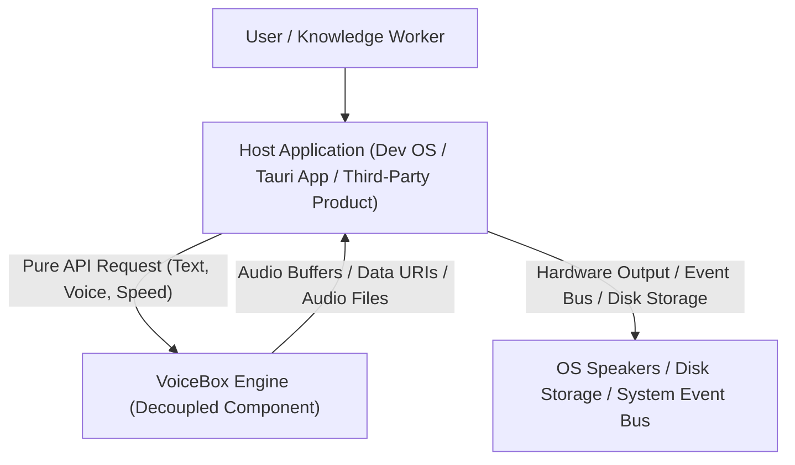
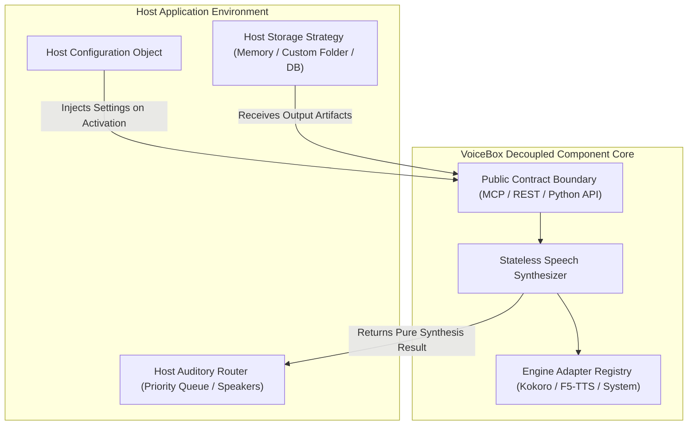
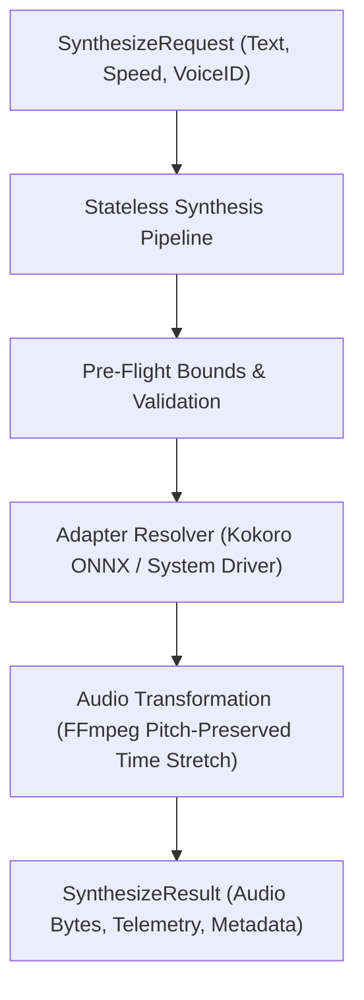

# Crucible Council Critique Report: Decoupling VoiceBox for Product Composability

## 1. Executive Summary & Fatal Flaw Diagnosis

This Crucible Council Critique Session evaluates the architectural coupling risks present in recent VoiceBox designs. 

### The Fatal Flaw Diagnosed
VoiceBox was inadvertently becoming **overcoupled** to specific workspace layouts (`work/`), framework conventions (`QSOS`), and hardcoded disk paths (`work/current-session.json`). 

If VoiceBox requires hardcoded directory structures or home-directory config files, it **fails as a standalone, composable product**. A third-party application (such as an electron app, mobile client, or web daemon) embedding VoiceBox would be forced to inherit fragile workspace conventions.

---

## 2. Advisor Critiques & Architectural Remedies

### Rich Hickey (Simple Made Easy)
> *"You have **compleated** synthesis with workspace state management. VoiceBox's essential complexity is pure transformation: turning text, voice parameters, and speed multipliers into audio buffers. As soon as VoiceBox reaches into a local `work/` directory or manages workspace session files, it becomes entangled. Keep VoiceBox stateless. Pass context in as immutable values."*

**Remedy**:
1. **Stateless Core Transformation**: VoiceBox core functions accept pure input structs (`SynthesizeRequest`) and return pure result values (`SynthesizeResult`).
2. **Inverted Persistence**: VoiceBox does not save workspace session files. It returns audio metadata and byte buffers, allowing host applications to save them wherever they choose.

---

### Robert C. Martin / Uncle Bob (Clean Architecture & Dependency Inversion)
> *"High-level policy (VoiceBox synthesis) must not depend on low-level details (file paths, OS folders). Apply the **Dependency Inversion Principle (DIP)**. VoiceBox defines interfaces for storage and logging; external hosts inject concrete implementations."*

**Remedy**:
1. **Dependency Injection on Activation**: External host applications configure VoiceBox at startup by passing configuration objects or interface drivers (e.g. `StorageAdapter`, `EventSink`).
2. **Zero Assumptions About Disk Topology**: VoiceBox core MUST NOT assume `.voicebox/`, `work/`, or home folder layouts. All paths are host-configured.

---

### Dave Farley (Component Modularization & CD)
> *"If embedding VoiceBox in another application requires dragging along a complex web of developer OS dependencies, your component boundaries are wrong. A good component has a minimal, clear interface surface."*

**Remedy**:
1. **Clean Component Interface Boundary**: Expose a minimal, self-contained MCP / REST / Python API contract that requires zero external framework dependencies.
2. **Plug-and-Play Composability**: VoiceBox should install as a lightweight library (`pip install voicebox`) or run as a standalone stdio process without prerequisite environment scripts.

---

### Fred Brooks (Conceptual Integrity)
> *"Conceptual integrity is the most important consideration in system design. VoiceBox's single conceptual identity is **The Universal Speech Engine**. Do not overload it with conversation management, UI layout policy, or process scheduling."*

---

## 3. The Decoupled C4 Architectural Model

### Level 1: System Context Diagram
Shows VoiceBox as an isolated, composable speech synthesis system embedded seamlessly inside host applications.

---

### Level 2: Container Architecture (Inverted Dependencies)
Shows how host applications inject configuration and storage drivers into VoiceBox via clean interfaces.

---

### Level 3: Component Diagram (Stateless Transformation Pipeline)
Shows the internal, pure data pipeline inside VoiceBox.

---

## 4. Consensus & Architectural Guardrails

1. **Zero Hardcoded File Paths**: VoiceBox core MUST NOT contain hardcoded references to `work/`, `tix-manifest.json`, or fixed user home directory paths.
2. **Inversion of Control**: All settings, storage locations, and audio playback policies are injected by the host application upon initialization.
3. **Stateless Core Operations**: Core functions take pure input structs and return pure result objects, making VoiceBox easily composable across any product.
