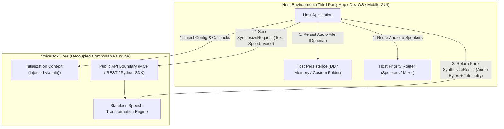

# Long-Form Summary: Decoupling VoiceBox, Product Composability & Inversion of Control

* **Document ID**: REPORT-2026-08-17-CRITIQUE-01
* **Date**: 2026-08-17
* **Status**: Canonical Architectural Directive (Accepted)
* **Chair & Sponsor**: Rob Dooh
* **Facilitator**: Antigravity AI
* **Council Panel**: Rich Hickey, Robert C. Martin (Uncle Bob), Dave Farley, Fred Brooks
* **Target Repositories**: `VoiceBox` (`catalyst/VoiceBox`), `QSOS` (`qsos`), `Agent OS` (`agent-os`)

---

## 1. Context & The Fatal Flaw Diagnosed

During recent iterations on VoiceMode, information hygiene, and multi-agent interaction design, the VoiceBox architecture subtly accumulated a dangerous anti-pattern: **overcoupling to specific workspace file topologies and developer OS process frameworks**.

Specifically, proposed designs introduced state-tracking mechanisms that relied on hardcoded workspace paths—such as writing session state ledgers to `work/current-session.json`, expecting `tix-manifest.json` configurations, or polluting the user's home directory with brittle `.voicebox/` folders.

While these conventions solved immediate multi-turn chat problems within our specific personal development environment, a critical architectural critique was raised:

> **The Core Problem**: VoiceBox is intended to be a **standalone, composable product component**. It must be capable of being embedded seamlessly into arbitrary external applications—such as a desktop GUI (Tauri/Electron), a web daemon, a mobile client, or an enterprise SaaS backend. If VoiceBox hardcodes assumptions about developer workspace folder structures or OS daemon paths, it cannot be embedded into another product without forcing that external product to adopt our entire internal development hierarchy.

To eliminate this fragility before it entrenched technical debt, an adversarial **Crucible Council Critique Session** was convened with four foundational software architects: **Rich Hickey**, **Robert C. Martin (Uncle Bob)**, **Dave Farley**, and **Fred Brooks**.

---

## 2. Key Findings & Advisor Debates

### Finding 1: Compleating Transformation with State Persistence (Rich Hickey)
Rich Hickey opened the critique by diagnosing a classic architectural error: **compleating pure data transformation with state persistence**.

VoiceBox’s essential domain complexity is **pure signal transformation**: taking an input text string, a requested voice model, pitch parameters, and speed multipliers, and producing an audio byte buffer or audio artifact. This transformation is naturally stateless.

However, by attempting to make VoiceBox "remember" active conversation sessions, track user preferences across context compactions, and write session ledgers to `work/current-session.json`, we mixed pure synthesis with state management. Hickey emphasized:

* **Values Over State**: VoiceBox should operate strictly on immutable input value structs (`SynthesizeRequest`) and return immutable output value structs (`SynthesizeResult`).
* **Zero Disk Entanglement**: VoiceBox core MUST NOT reach into local project directories (`work/`) to read or write session state. Persistence belongs entirely to the host application that embeds VoiceBox.

---

### Finding 2: Violation of Dependency Inversion & Boundary Leaks (Uncle Bob Martin)
Robert C. Martin evaluated the system through the lens of Clean Architecture and the **Dependency Inversion Principle (DIP)**.

High-level policy (speech synthesis generation) was being subjected to low-level implementation details (file system paths, directory structures, and specific developer OS process daemons). Uncle Bob highlighted that boundary leaks inevitably destroy composability:

* **Inversion of Control (IoC)**: High-level modules must define pure interfaces for storage, logging, and audio output. Concrete host environments (whether a developer OS CLI or a third-party React Native app) must inject concrete implementations into VoiceBox at startup.
* **Zero Assumptions About Storage Topology**: VoiceBox should never assume where config or telemetry lives on disk. If configuration is needed, it must be passed in as a configuration object during initialization (`voicebox.init(config)`).

---

### Finding 3: Component Isolation & Deployment Rigor (Dave Farley)
Dave Farley evaluated VoiceBox from a Continuous Delivery and component modularization perspective.

A core tenet of modern software engineering is that a component must possess a **minimal, well-defined interface surface**. If installing or embedding VoiceBox requires dragging along a complex web of prerequisite workspace folders, environment variables, or background daemons, the component boundary is flawed.

* **Plug-and-Play Composability**: VoiceBox should be deployable as an isolated, standalone library (`pip install voicebox`) or a lightweight MCP/stdio service.
* **Minimal API Surface**: The public API contract must expose clean, un-entangled endpoints (e.g. `synthesize()`, `audition()`, `list_voices()`) that accept raw parameters and return pure audio data, leaving execution strategy to the caller.

---

### Finding 4: Conceptual Integrity & Scope Creep (Fred Brooks)
Fred Brooks reinforced the importance of **Conceptual Integrity**. A system's design must be guided by a single, coherent conceptual identity.

VoiceBox’s conceptual identity is **The Universal Speech Synthesis Engine**. Overloading VoiceBox to act as a conversational session manager, a priority process scheduler, or a UI layout coordinator dilutes its conceptual clarity and introduces essential complexity where none should exist.

---

## 3. Where We Arrived: The Decoupled Architecture Consensus

The Council arrived at a unanimous consensus establishing four non-negotiable architectural directives for VoiceBox:

### Strategic Decisions Reached

1. **Stateless Core Transformation**:
   The core functions of VoiceBox (`synthesize_speech`, `audition_voice`) operate as pure, stateless transformations. They take explicit, immutable request objects and return pure result objects containing audio byte buffers, telemetry, and metadata.

2. **Inversion of Control (IoC) via Dependency Injection**:
   VoiceBox makes zero assumptions about disk topology. When initialized, the host application passes an initialization context (`VoiceBoxConfig`). If the host wants audio saved to a specific folder, it provides the target path in the request or handles file writing itself.

3. **Separation of Capabilities vs. System Integration**:
   * **VoiceBox Responsibility**: Provide reliable, ultra-fast text-to-speech, voice auditioning, pitch-preserved time stretching, and streaming byte chunks.
   * **Host Application Responsibility**: Manage conversation session history, context compaction persistence, multi-agent priority queuing, and UI display density.

4. **Zero Home-Directory Pollution**:
   VoiceBox will NOT create dedicated, hardcoded hidden folders in the user’s root directory (`~/.voicebox/`). All persistent caching or temporary storage locations must be host-configurable or utilize standard OS temporary locations (`/tmp` or OS cache dirs) with clean fallback defaults.

---

## 4. Implementation Impact & Next Steps

* **Refactor Core MCP Server (`mcp/tts_voice_mcp.py`)**: Ensure all MCP tool handlers accept explicit parameters and avoid referencing workspace-specific paths (`work/`).
* **Update System Documentation**: Lock the 3-level C4 Mermaid diagrams in `qsos/docs/architecture/` and update project specs to reflect clean Dependency Inversion.
* **Publish Clean SDK Contract**: Formalize the Python SDK and MCP interface so VoiceBox can be imported into any application with a single line of code (`import voicebox`).
