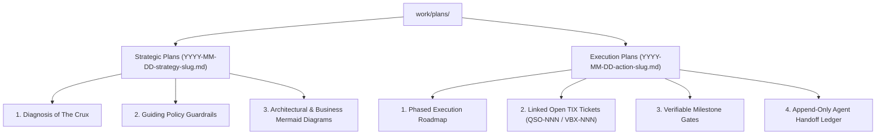

# Crucible Council Session: Provider-Agnostic Canonical Plan Standard

## 1. Executive Summary & Session Objectives

This Crucible Council Design Session evaluates the preliminary proposal for a **Provider-Agnostic Canonical Plan Standard** (`QSO-032`) designed to bridge high-level architectural vision (`ADRs`) and granular work items (`Open TIX tickets`).

### Primary Goal
Establish a robust, repo-bound plan architecture (`work/plans/YYYY-MM-DD-<type>-<slug>.md`) that enables AI agents across disparate providers (Gemini, Claude Desktop, Cursor, OpenAI) and independent chat sessions to read, update, and collaborate on shared plans without context loss or vendor lock-in.

---

## 2. Advisor Perspectives & Key Contributions

### Richard Rumelt (Strategy & The Crux)
> *"Beware of confusing strategic plans with mere goal wishlists. A true `strategy` plan must focus squarely on **The Crux**—the single most difficult obstacle standing between current state and desired outcome. If a strategy document is just a bulleted list of optimistic milestones without a diagnosis of the core challenge, it is bad strategy."*

**Key Recommendations**:
1. **Mandatory 'Crux' Section**: Require every `strategy` plan to begin with an explicit **Diagnosis of the Crux**.
2. **Coherent Action Mapping**: Ensure every strategic outcome maps directly to a set of coherent policy guardrails and concrete execution paths.

---

### Martin Fowler (Enterprise Architecture & Evolutionary Design)
> *"Plans must be evolutionary, not static waterfall artifacts. As work progresses and unexpected discoveries occur, agents must be able to refactor plans without breaking links to existing tickets or ADRs."*

**Key Recommendations**:
1. **Immutable Ticket References**: Action plans should reference Open TIX ticket IDs (`VBX-001`, `QSO-032`) rather than embedding volatile inline task details.
2. **Bi-Directional Provenance**: Tickets must reference their parent plan (`plan: work/plans/2026-08-17-action-vbx-v2-roadmap.md`) so agents navigating from a ticket can immediately jump to the overarching plan context.

---

### Andy Matuschak (Thought Synthesis & Mnemonic Systems)
> *"File names are low-bandwidth proxies for knowledge. The `YYYY-MM-DD` ISO timestamp prefix is a great start, but we also need strong header metadata so agents can perform high-density semantic searches across plans."*

**Key Recommendations**:
1. **YAML Frontmatter Standardization**: Enforce frontmatter with `created`, `updated`, `owner`, `active_phase`, `crux`, and `tickets`.
2. **Agent Handoff Log**: Every plan should end with a lightweight append-only **Handoff Ledger** where agents record 2-line shift transition notes.

---

### Tiago Forte (PARA Architecture & Workspace Organization)
> *"Keep folder hierarchies shallow and functional. Placing all active plans in `work/plans/` follows PARA principles by grouping active work-in-progress in a single predictable location."*

**Key Recommendations**:
1. **Shallow Directory Layout**: Standardize on `work/plans/` (no deep nested subfolders).
2. **Status Lifecycle**: Use explicit frontmatter statuses: `draft` $\rightarrow$ `active` $\rightarrow$ `completed` $\rightarrow$ `archived`.

---

### Dave Farley (Continuous Delivery & Feedback Loops)
> *"A plan is a hypothesis. In Continuous Delivery, we test hypotheses continuously. An execution plan must contain verifiable milestone gates."*

**Key Recommendations**:
1. **Verifiable Milestone Gates**: Every phase in an `action` plan must specify explicit verification commands (e.g., test suite execution, coverage thresholds).
2. **Completion Criteria**: An `action` plan cannot transition to `completed` status until all linked Open TIX tickets are closed and verified.

---

## 3. Structural Model & Synthesis Matrix

### Plan Subtype Synthesis Matrix

| Aspect | **Strategic Plan (`strategy`)** | **Execution Plan (`action`)** |
| :--- | :--- | :--- |
| **Primary Horizon** | Macro / Structural (Quarter / Multi-Month) | Tactical / Execution (Sprint / Multi-Week) |
| **Core Element** | Diagnosis of The Crux & Guiding Policy | Phased Roadmap & Linked Tickets |
| **Primary Diagrams** | System Architecture & Cynefin Domain Maps | Flowcharts & Sequence Diagrams |
| **Verification Gate** | Architectural Review & ADR Alignment | Test Suite Execution & Acceptance Criteria |
| **Naming Format** | `YYYY-MM-DD-strategy-<slug>.md` | `YYYY-MM-DD-action-<slug>.md` |

---

## 4. Consensus & Action Directives

1. **Update `QSO-032` Specification**:
   Enhance `QSO-032` to incorporate Rumelt's *Crux Diagnosis* requirement for `strategy` plans and Fowler's *Bi-Directional Ticket Linking* requirement for `action` plans.
2. **Implement Agent Handoff Ledger Standard**:
   Require all `action` plans to include an `## Agent Handoff Ledger` section at the end of the document.
3. **Register Artifact in QSOS Workspace**:
   Store this report permanently in `qsos/docs/council-reports/`.
