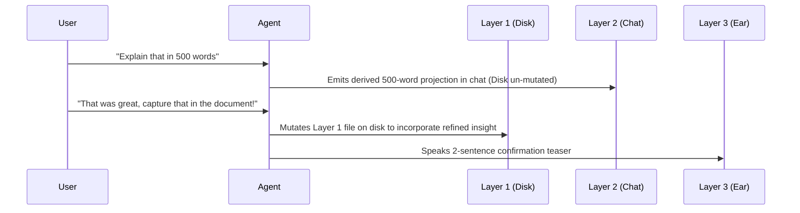

# Stage 1 Crucible Council Report: 3-Layer Information Hygiene & Dynamic Projection Refinement

## 1. Executive Summary

Stage 1 resolves the core human-agent interaction contract for multi-modal work. When AI agents operate across text, markdown documents, and live speech, information must be structured in three distinct layers to prevent data loss while keeping the user oriented.

---

## 2. Core Architectural Design: The 3-Layer Information Hygiene Standard

```mermaid
graph TD
    Layer1["Layer 1: Canonical Source File on Disk (Deep Truth)"] --> Layer2["Layer 2: Token-Efficient Chat Highlights & File Link"]
    Layer2 --> Layer3["Layer 3: Spoken Podcast Teaser (Ear Delivery)"]
    
    Subgraph "Execution Order"
        L1["1. Write complete un-truncated markdown to disk"]
        L2["2. Emit 1-5 sentence headline summary + file link in chat"]
        L3["3. Synthesize 2-3 sentence spoken teaser via VoiceBox"]
    end
```

### Layer Definitions

1. **Layer 1: Canonical Source File on Disk (Deep Truth)**
   - Always written to disk FIRST before chat or audio output (e.g. `docs/council-reports/`, `docs/decisions/`, `work/plans/`).
   - Contains 100% complete, un-truncated technical detail, diagrams, and code snippets.
   - Serves as the immutable reference for future shifts, search indexing, and cross-agent context.

2. **Layer 2: Token-Efficient Chat Headline (High-Density Screen Summary)**
   - Written to the active chat window.
   - Contains a concise 1–5 sentence headline summary and key highlights.
   - **Mandatory Requirement**: Must include an explicit, clickable file link (`file:///path/to/file.md`) pointing to Layer 1.

3. **Layer 3: Audio Podcast Teaser (Live to Ear)**
   - Synthesized via VoiceBox `synthesize_speech` natively when Voice Mode is ON.
   - Concise 2–3 sentence spoken monologue delivered live to system hardware at active user speed (e.g., `1.3x`).
   - Anchors the user verbally while they look at other screens or disengage from typing.

---

## 3. Dynamic Projection Refinement Protocol

Users frequently interact with Layer 2 and Layer 3 outputs by asking for depth adjustments or phrasing updates.



### Protocol Guardrails:
* **Derived Projections**: When a user asks for a expanded explanation (*"Explain in 500 words"*), the agent emits a temporary chat projection without mutating Layer 1.
* **Canonical Persistence**: When the user approves a phrasing (*"Capture that in the doc"*), the agent updates Layer 1 on disk to permanently capture the refined insight.

---

## 4. Advisor Consensus & Directives

1. **Forbidden Anti-Pattern**: NEVER emit long audio monologues without writing the canonical Layer 1 text file to disk first.
2. **Mandatory File Linking**: Every Layer 2 chat output must contain an explicit file link (`file:///...`).
3. **Codified Skill Contract**: Enforce this standard across all agent harnesses via `~/.gemini/config/skills/voice-teaser/SKILL.md`.
