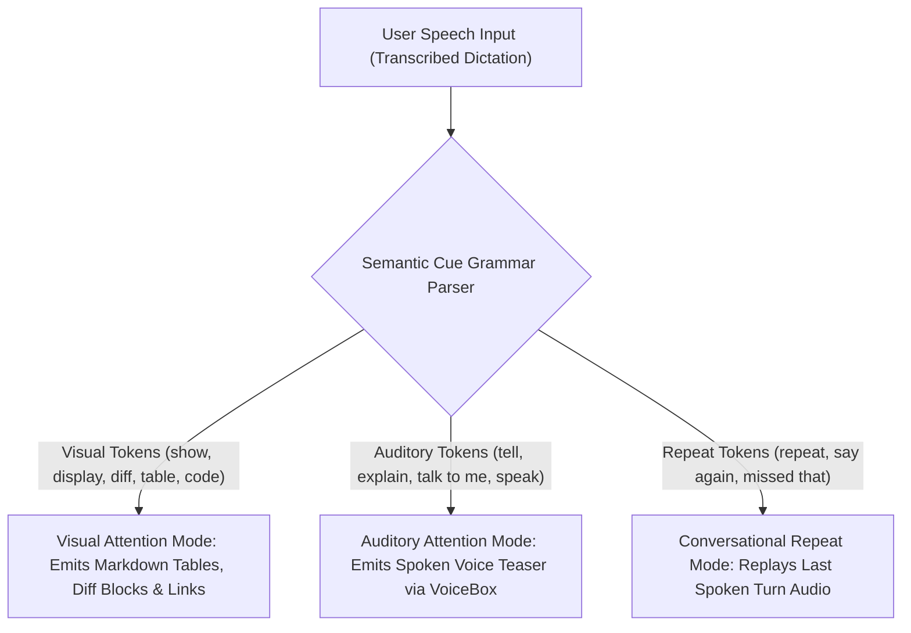

# Stage 2 Crucible Council Report: Semantic Input Cue Parsing

## 1. Executive Summary

Stage 2 establishes the prompt-parsing grammar that allows AI agents to automatically detect whether a user's verbal prompt requires high-density visual screen text, an immediate spoken voice response, or a conversational audio repeat.

---

## 2. The Semantic Cue Mapping Grammar

### Cue Classification Rules

1. **Visual Attention Tokens (`visual`)**:
   - *Keywords*: `"show"`, `"display"`, `"diff"`, `"code"`, `"table"`, `"visualize"`, `"view"`, `"list"`.
   - *Behavior*: Directs primary density to the chat window (Layer 2) using formatted tables, diff blocks, and `file://` links. Minimizes spoken audio to a 1-sentence acknowledgment if Voice Mode is ON.

2. **Auditory Attention Tokens (`auditory`)**:
   - *Keywords*: `"tell me"`, `"explain"`, `"talk to me"`, `"verbally"`, `"speak"`, `"what's the status"`, `"recap"`.
   - *Behavior*: Directs primary delivery to the ear (Layer 3) via VoiceBox at active user speed (`1.3x`). Chat window receives a 1-paragraph summary headline.

3. **Conversational Repeat Tokens (`repeat`)**:
   - *Keywords*: `"repeat"`, `"say that again"`, `"I missed that"`, `"what was that"`, `"one more time"`.
   - *Behavior*: Triggers instant audio replay of the last spoken turn via VoiceBox without re-printing duplicate long text blocks in chat.

---

## 3. Advisor Consensus & Directives

1. **Natural Dictation Disambiguation**: Users dictating via speech-to-text naturally use auditory cues ("tell me about X"). Agents must parse these cues to automatically deliver spoken responses when Voice Mode is ON.
2. **Zero Text Spam on 'Repeat'**: When the user says "repeat that", the agent MUST NOT re-paste 50 lines of text into the chat. It must trigger native audio replay (`replay_speech`).
