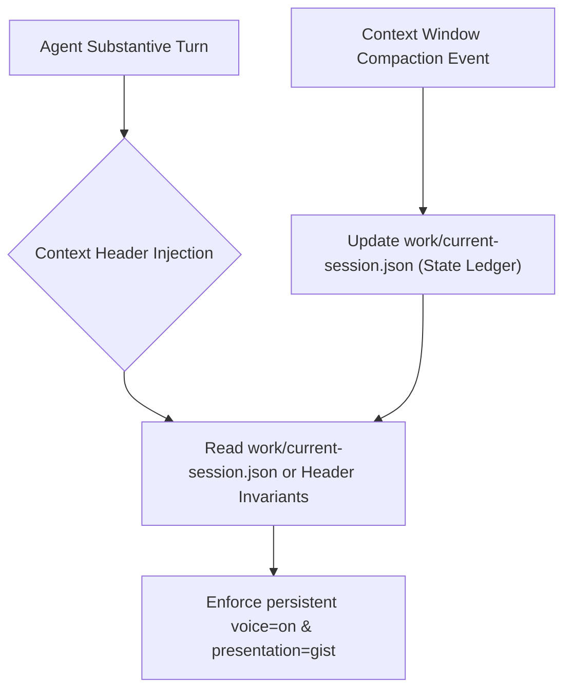

# Stage 3 Crucible Council Report: Compaction Resilience & State Persistence

## 1. Executive Summary

Stage 3 resolves the issue of silent voice dropouts during extended sessions. When an LLM context window reaches its token limit and undergoes compaction or truncation, agents frequently lose track of active session flags (like `voice=on`). This session establishes the architectural mechanism to guarantee 100% state persistence across compactions.

---

## 2. Architectural Design: Session Ledger & Header Injection



### Core Resilience Mechanisms

1. **Repository-Bound Session Ledger (`work/current-session.json`)**:
   - Agent session toggles (`voice: true`, `presentation: "gist"`, `speed: 1.3`, `active_plan: "PLAN-021"`) are mirrored to a local lightweight JSON file in the project workspace.
   - When a context truncation occurs, the agent skill reads `current-session.json` during orientation and restores all active toggles seamlessly.

2. **Substantive Response Header Injection**:
   - Every substantive agent response includes an internal state header at the start of its turn:
     ```text
     presentation=gist voice=on speed=1.3 active_plan=PLAN-021
     ```
   - When context compaction synthesizes past conversation history, this metadata header ensures the compaction summary preserves the active voice mode status.

---

## 3. Advisor Consensus & Directives

1. **Zero Silent Dropouts**: Voice Mode is an explicit user preference. Context compaction MUST NOT mute voice output.
2. **Idempotent Orientation**: Skill contracts (`/qsos-orient` and `voice-teaser`) must verify session state from `work/current-session.json` on every turn.
