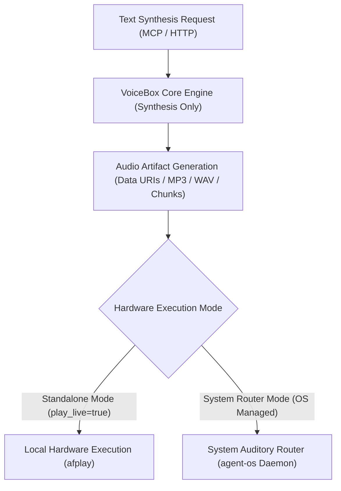

# Stage 4 Crucible Council Report: VoiceBox Core Engine Boundaries

## 1. Executive Summary

Stage 4 evaluates the architectural boundary between the VoiceBox Speech Synthesis Engine and the OS-level hardware audio system. Currently, VoiceBox acts as both a TTS synthesis engine (converting text to audio buffers/files) and a direct hardware audio driver (`afplay`). This session formalizes the decoupling of synthesis from hardware execution.

---

## 2. Decoupled Boundary Architecture

### Core Boundary Rules

1. **VoiceBox Core Utility (Synthesis Engine)**:
   - Primary responsibility: Transform text, speed multipliers, and voice specs into high-fidelity audio artifacts (MP3, WAV, Base64 Data URIs, or SSE streaming byte chunks).
   - VoiceBox core is decoupled from OS speaker permissions, audio mixing, and multi-agent priority queues.

2. **Hardware Playback Layer**:
   - In **Standalone Developer Mode** (`play_live: true`), VoiceBox includes a lightweight local hardware driver (`afplay`) for instant standalone playback.
   - In **System Ecosystem Mode** (multi-agent workspace), VoiceBox yields synthesized audio artifacts to the **System Auditory Router** (`agent-os`), which manages physical speaker execution, priority queuing, and session isolation.

---

## 3. Advisor Consensus & Directives

1. **Simple Made Easy (Hickey)**: Do not compleat synthesis (computational transformation) with hardware playback (physical OS device side-effects).
2. **Dual-Mode Capability**: Retain local `afplay` fallback so VoiceBox works out-of-the-box as a self-contained CLI/MCP server without requiring `agent-os` daemons.
