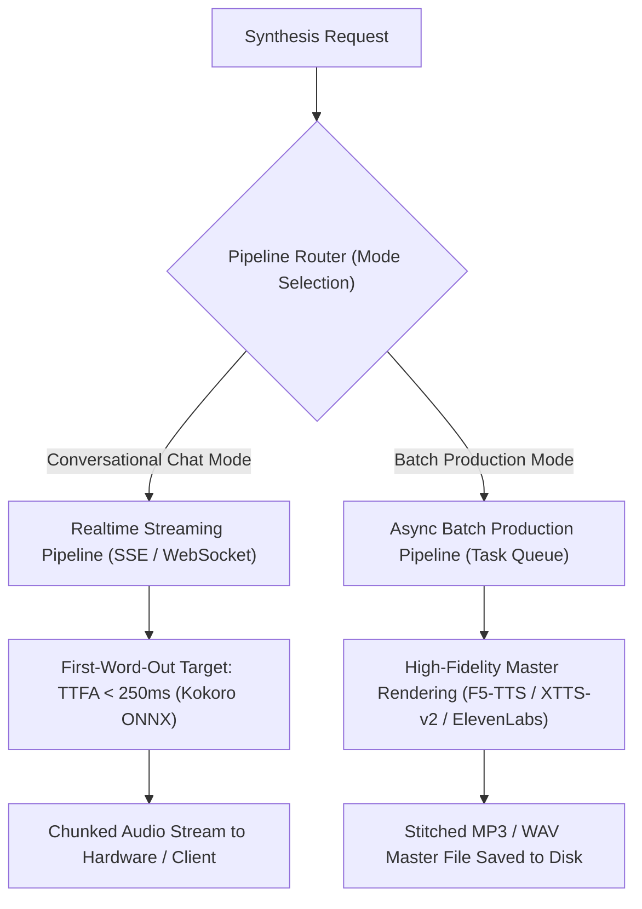

# Stage 5 Crucible Council Report: Realtime Conversational Streaming vs Async Batch Production

## 1. Executive Summary

Stage 5 delineates the two primary operational modes of VoiceBox: **Realtime Conversational Streaming** (low-latency, First-Word-Out for active chat) and **Asynchronous Batch Production** (high-quality multi-speaker podcast generation, transcripts, and file rendering).

---

## 2. Dual-Pipeline Architecture

### Mode Comparison Matrix

| Dimension | **Realtime Conversational Streaming** | **Asynchronous Batch Production** |
| :--- | :--- | :--- |
| **Primary Metric** | Time-To-First-Audio (TTFA < 250ms) | Overall Audio Quality, Pitch Smoothness & Stitching |
| **Transport** | SSE (Server-Sent Events) / WebSocket | Async Task Queue / JSON-RPC / File Download |
| **Target Engine** | Kokoro-82M ONNX (Sub-second lightweight) | F5-TTS / XTTS-v2 / ElevenLabs (Heavy transformers) |
| **Use Case** | Active agent voice chat, quick status teasers | Multi-turn council recordings, podcasts, offline listening |

---

## 3. Advisor Consensus & Directives

1. **First-Word-Out Priority**: In conversational mode, streaming chunk generation must start before the entire sentence vector is synthesized.
2. **Explicit Mode Flag**: API parameters must explicitly declare `mode: "conversational"` vs `mode: "batch"` so VoiceBox selects the optimal engine and transport.
