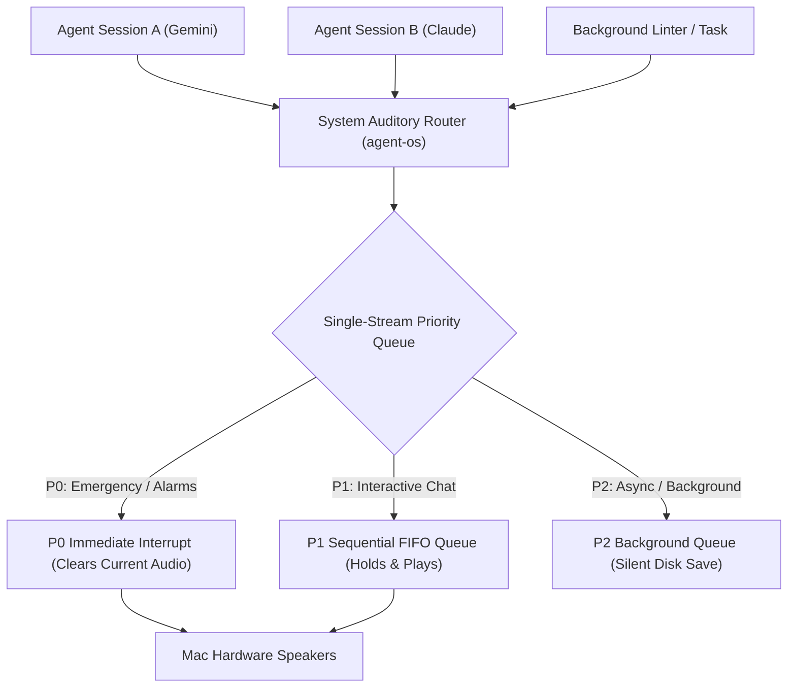

# Stage 6 Crucible Council Report: Multi-Agent Concurrency & Priority Queuing

## 1. Executive Summary

Stage 6 solves the multi-agent audio collision problem. In workspaces with multiple concurrent agents (Gemini, Claude Desktop, Cursor, background scripts), uncoordinated audio requests attempt to play simultaneously, producing garbled sound. This session designs the **System Auditory Priority Queue** managed by `agent-os`.

---

## 2. Priority Queue Architecture

### Priority Tiers & Preemption Rules

1. **P0 Tier (System Emergency & Alarms)**:
   - *Scope*: System errors, user alerts, high-priority timers.
   - *Behavior*: Instantly preempts and stops (`pkill -9 afplay`) any currently playing speech and plays immediately.

2. **P1 Tier (Interactive Conversational Agent Chat)**:
   - *Scope*: Active user-agent chat turns (Gemini, Claude, Cursor).
   - *Behavior*: Queued in a single-stream FIFO queue. If Agent A is speaking, Agent B's spoken response waits in queue until Agent A finishes, preventing audio overlap.

3. **P2 Tier (Asynchronous Background Tasks)**:
   - *Scope*: Automated test runs, background linting, async podcast generation.
   - *Behavior*: Rendered to disk silently without auto-playing over hardware speakers unless explicitly requested by the user.

---

## 3. Advisor Consensus & Directives

1. **Single Speaker Mutex Lock**: The System Auditory Router MUST hold a hardware playback mutex lock to guarantee 100% non-overlapping single-stream audio execution.
2. **Preemption Isolation**: Only P0 Emergency requests are allowed to interrupt active P1 speech.
