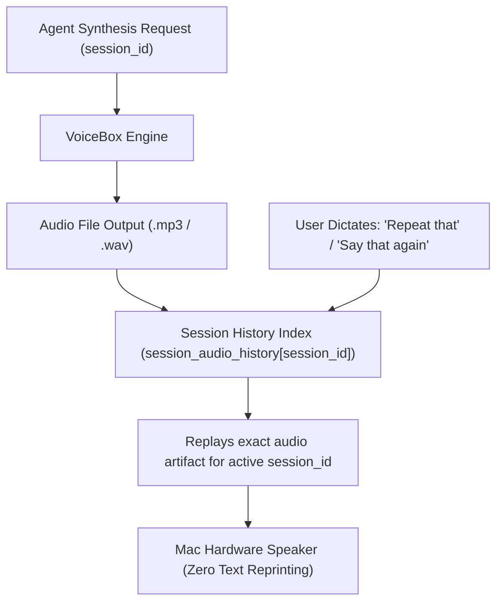

# Stage 7 Crucible Council Report: Session-Bound Conversational 'Repeat' Bus

## 1. Executive Summary

Stage 7 completes the 7-stage architectural series by replacing mechanistic global `replay_speech` with a session-aware conversational **`repeat`** bus. When a user in Session A says *"repeat that"*, the system replays the exact audio artifact spoken by *Session A*, isolating it from audio generated by Session B or background tasks.

---

## 2. Session-Bound Repeat Architecture

### Key Architectural Invariants

1. **Session History Indexing**:
   - `session_audio_history[session_id]` maintains an in-memory rolling ring buffer of spoken audio artifacts for each active conversation session.
2. **Conversational Intent Mapping**:
   - Mechanistic `replay(file_path)` is reserved for low-level file playback.
   - Conversational `repeat(session_id)` is used by agents when responding to verbal cues (*"repeat that"*, *"say that again"*).
3. **Zero Text Duplication**:
   - Replaying a spoken turn executes pure audio replay over hardware speakers without re-printing duplicate text blocks in chat.

---

## 3. Advisor Consensus & Directives

1. **Isolation Guarantee**: Session A can never accidentally replay an audio file synthesized by Session B.
2. **Backward Compatibility**: If `session_id` is omitted, the system falls back to replaying the global last synthesis artifact.
