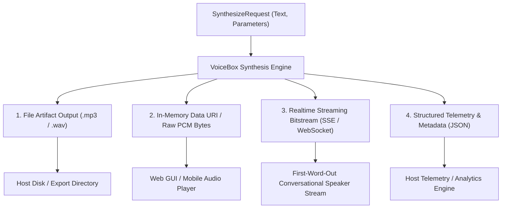
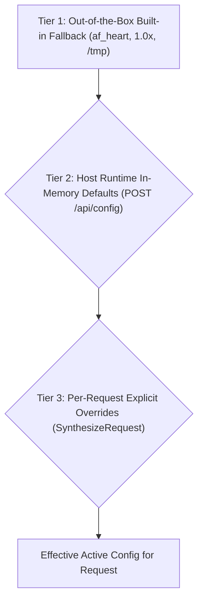

# ADR-033: VoiceBox Output Consumption Patterns & Hierarchical Config Cascade

* **Status**: Accepted
* **Date**: 2026-08-17
* **Deciders**: Rob Dooh & Antigravity AI
* **Consulted**: Rich Hickey, Robert C. Martin (Uncle Bob), Dave Farley

---

## 1. Context & Problem Statement

Following our Council Critique on Decoupling VoiceBox, two operational questions emerged:
1. **Output Consumption Patterns**: What are the exact output formats produced by VoiceBox, and how do embedding host applications consume them?
2. **Configuration Lifecycle & In-Flight Overrides**: How does VoiceBox manage default settings, runtime configuration updates, and per-request parameter overrides without restarting services or violating stateless core boundaries?

---

## 2. Decision Outcome & Architecture

### Part 1: The 4 VoiceBox Output Consumption Patterns

1. **File Artifact Output (`format: "mp3"` / `"wav"`)**:
   - *Use Case*: Long-form transcripts, council sessions, podcasts, offline exports.
   - *Consumption*: Returns absolute filepath (`/host/custom/path/speech_123.mp3`) and file metadata.
2. **In-Memory Data URI / Raw Byte Stream**:
   - *Use Case*: Memory-only clients, web browsers, mobile apps that do not want disk I/O.
   - *Consumption*: Returns Base64 Data URI (`data:audio/mp3;base64,...`) or raw PCM byte arrays.
3. **Realtime Chunked Bitstream (SSE / WebSocket)**:
   - *Use Case*: Ultra-low latency agent chat (First-Word-Out < 250ms).
   - *Consumption*: Emits progressive audio byte chunks as speech is synthesized.
4. **Structured Telemetry & Metadata**:
   - *Use Case*: Quality tracking, performance monitoring.
   - *Consumption*: Returns JSON metadata containing `ttfa_ms`, `sample_rate`, `engine_used`, `duration_sec`, and `voice_id`.

---

### Part 2: The 3-Tier Hierarchical Configuration Cascade

### Hierarchy Rules

1. **Tier 1 — Built-in Zero-Config Fallback**:
   VoiceBox ships with sensible built-in defaults (e.g. `af_heart` voice, `1.0` speed, standard OS `/tmp` cache). VoiceBox works out-of-the-box with zero initialization required.

2. **Tier 2 — Host Runtime In-Memory Injected Defaults (`POST /api/config`)**:
   The host application can dynamically push or update application-wide defaults in memory via API at any time **without restarting the service**.
   - *Example*: Host sets default voice to `am_michael`, default speed to `1.2x`, or host-configured export directory.

3. **Tier 3 — Per-Request Explicit Overrides (`SynthesizeRequest`)**:
   Any individual API invocation can explicitly override any configuration parameter for that single request.
   - *Example*: A specific call passes `voice_id: "bm_george"`, `speed: 1.5`, or `output_dir: "/user/custom/export"`.

---

## 3. Consistency Guarantee

* **No Rule Broken**: In-memory host state updated via API does **not** break stateless core transformation. The core transformation engine remains pure (`f(request, effective_config) -> audio_result`), while the host application owns the runtime configuration lifecycle.
